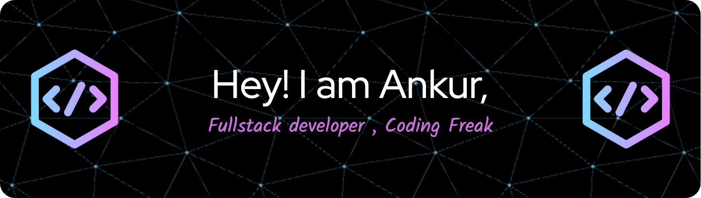
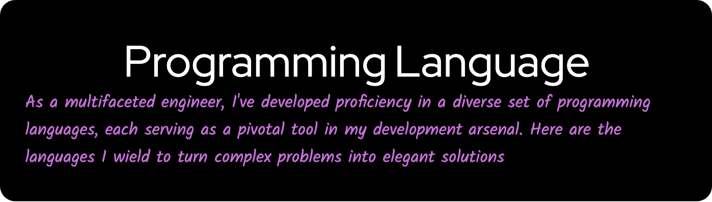

# Hey there :wave:

<h3 align="center">🥸Passionate about frontend and backend development as well as Data Structures and Algorithms.My goal is to continue pushing the boundaries of technology and contribute to innovative solutions in the tech industry🫡</h3>

  

  

  

HTML CSS Result Skip Results Iframe
body { margin: 0; background: #53917E; }

span {
  position: absolute;
  display: block;
  width: 450px;
  height: 450px;
  left: 50%;
  top: 50%;
  transform: translate(-50%,-50%);
}

article {
  margin: 0;
  position: absolute;
}

figure {
  position: absolute;
  background: #B9E3C6;
  width: 150px;
  height: 150px;
  animation: idk2 2s ease infinite;
  margin: 0;
}

.what figure {
  animation: idk2 2s ease infinite;
  animation-direction: reverse;
}

figure:nth-child(2) {
  left: 150px;
  animation-delay: .5s;
}

figure:nth-child(3) {
  left: 150px;
  top: 150px;
  animation-delay: 1s;
}

figure:nth-child(4) {
  top: 150px;
  animation-delay: 1.5s;
}

div {
  width: 50px;
  height: 50px;
  position: absolute;
  background: #EAF4D3;
  animation: idk 2s ease infinite;
}

div:nth-child(2) {
  left: 50px;
  animation-delay: .5s;
}

div:nth-child(3) {
  left: 50px;
  top: 50px;
  animation-delay: 1s;
}

div:nth-child(4) {
  top: 50px;
  animation-delay: 1.5s;
}

@keyframes idk {
  0% {
    transform: translateX(0);
  }
  25% {
    transform: translateX(50px) rotate(90deg);
  }
  50% {
    transform: translateX(50px) translateY(50px) rotate(0);
  }
  75% {
    transform: translateX(0) translateY(50px) rotate(90deg);
  }
  100% {
    transform: translateX(0);
  }
}

@keyframes idk2 {
  0% {
    transform: translateX(0);
  }
  25% {
    transform: translateX(150px) rotate(90deg);
  }
  50% {
    transform: translateX(150px) translateY(150px) rotate(0);
  }
  75% {
    transform: translateX(0) translateY(150px) rotate(90deg);
  }
  100% {
    transform: translateX(0);
  }
}
- 🔭 I’m currently working on **Brain Computer Interface for Assistance**

- 🌱 I’m currently learning **MERN, Vite, Git, API**

- 👯 I’m looking to collaborate on [Chess Game](https://github.com/ankurpandey786/Chess-one)

- 🤝 I’m looking for help with [InstaClone](https://github.com/ankurpandey786/Insta-clone)

- 👨‍💻 All of my projects are available at [https://github.com/ankurpandey786](https://github.com/ankurpandey786)

- 📝 Know more about me [ankurpandey.vercel.app](ankurpandey.vercel.app)

- 💬 Ask me about **DSA, CS Core, BCI**

- 📫 How to reach me **ankurpandey2701@gmail.com**

- 📄 Know about my experiences [https://ankurpandey.vercel.app/Ankur_Pandey_CV.pdf](https://ankurpandey.vercel.app/Ankur_Pandey_CV.pdf)

  

    <!-- Replace with your skills -->
    
    
    
    
    
    
    
       
    
   

<h3 align="left">Connect with me:</h3>

<h3 align="left">Languages and Tools:</h3>

 
  
  
  
  
  
  
  
  
  
  
  
  
  
  
  
  

